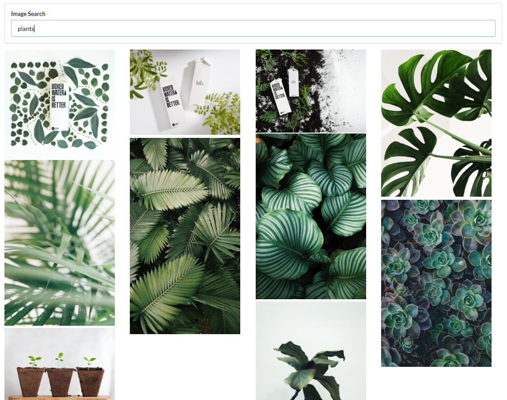

# Photo Gallery App

This app was created as part of the [Modern React with Redux Course](https://www.udemy.com/course/react-redux/) on Udemy.

## To Start the Development Server

- Ensure that you have Node.JS and npm installed
- Clone the repository
- Register for an Unsplash API key [here](https://unsplash.com/developers)
- In the root directory, create a `.env` file
- In `.env`, add `REACT_APP_UNSPLASH_API_KEY` with the Unsplash API key
- In a terminal:
  - `npm install`
  - `npm run start`
- Go to `localhost:3000` in your browser

## How to Use

- Type a search query in the "Image Search" box and hit Enter

## Core Concepts

- Utilizes `React.createRef()` in order to dynamically space image elements of varying heights
- Developed using the [Unsplash Developer API](https://unsplash.com/developers) to retrieve photos
